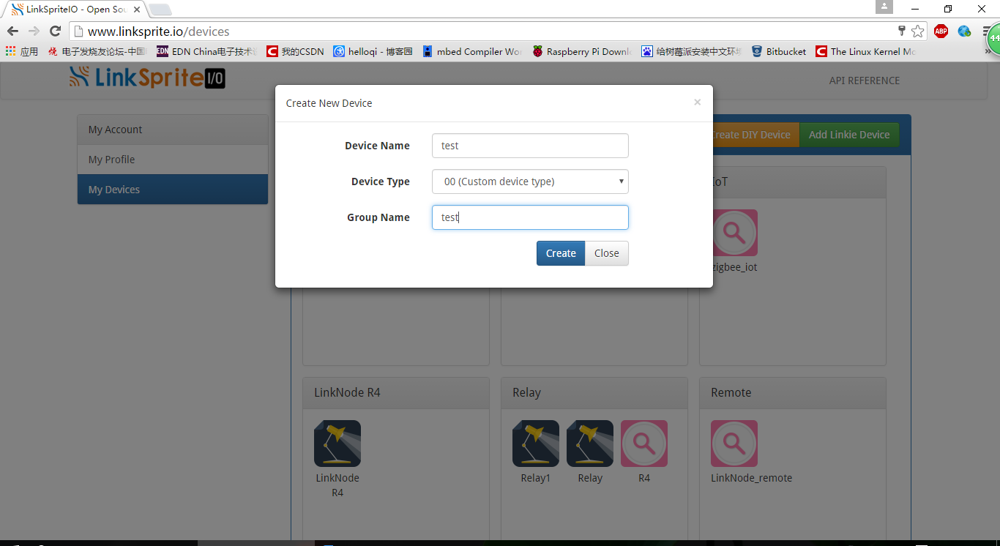
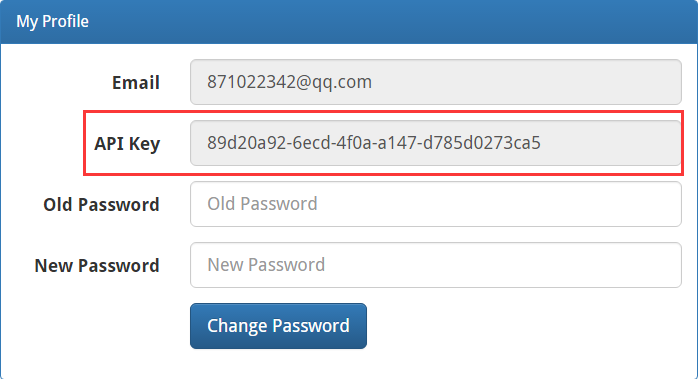
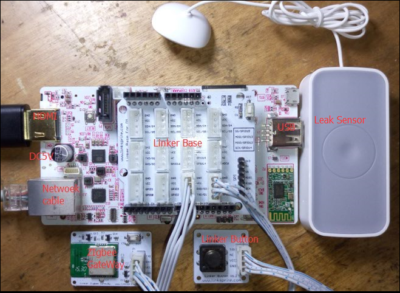
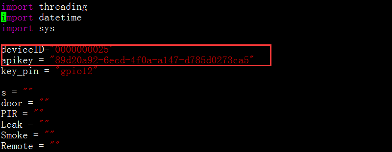
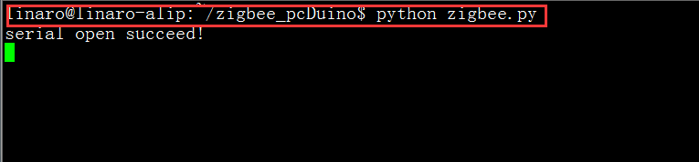
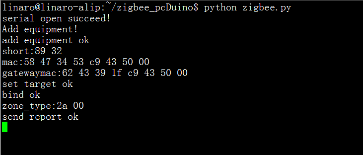
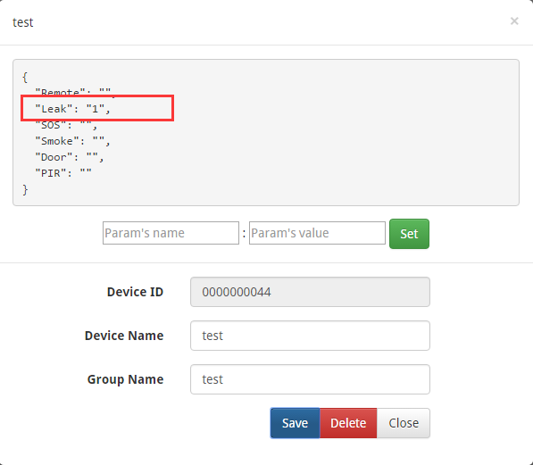

### 准备材料
* pcDuino 3B x 1  
* HDMI显示器 x 1  
* Zigbee GateWay x 1  
* Linker Button x 1  
* Link Base x 1
* Zigbee Leak Sensor x 1

### 注册登录[LinkSprite.io](www.linksprite.com)
网页进入www.linksprite.io注册一个账号，并登录，在自己的账号下面建一个DIY设备，设备类型为00(Custom device type),设备名和设备分组可以随便。   
* 注册[www.linksprite.io](www.linksprite.com)
* 登录此账号  
* 创建一个设备，设备编号为00，设备名和设备分组可以自己DIY。 
* 获取设备的deviceID
* 获取设备的apikey

### 系统运行
将Zigbee需要的硬件设备与pcDuino 3B连接好，开始我们的第一个设备的接入——门磁
* 将已经装好系统的pcDuino 3B接上显示屏
* 为pcDuino 3B接上Zigbee GateWay
* 为pcDuino 3B接上Linker Button 
* 为pcDuino 3B接上网线（也可以用无线网）
* 接上5V电源，鼠标，键盘给pcDuino 3B开机     

### 运行Zigbee code
打开一个终端，在github上获取需要的代码，修改代码中的deviceID和apikey,运行代码并添加一个设备。
* 获取zigbee.py代码:https://github.com/delongqilinksprite/zigbee.git
* 根据上面获取的apikey和deviceID修改代码中的apikey和deviceID
* 执行代码
* 添加第一个设备Leak Sensors    

修改zigbee.py代码中的apikey和deviceID   
  

执行zigbee.py程序，复位Leak sensors，按下button添加这个设备。  
  
用卡针戳Leak Sensor的RST，直至上面的绿色的快速闪烁时此时便可以添加设备，按下button添加设备。  
  
   
到这里我们的Leak Sensor已经添加成功，此时我们可以在我们的LinkSPrite.io观察Leak Sensor的状态了。Leak Sensor是一个漏水检测的传感器，我们此时将它的触角放到有水的地方，然后便可以在linksprite.io看到状态了。  
 

### 添加其它设备
按照上述的步骤我们已经可以添加一个设备了，接着我们继续添加其它设备，此时会更加容易。  
* 运行zigbee.py程序
* 复位传感器使之快速闪烁成可添加状态
* 按下button添加设备，等待添加完成
* 使添加的传感器报警，在LinkSprite.io观看相应的状态
